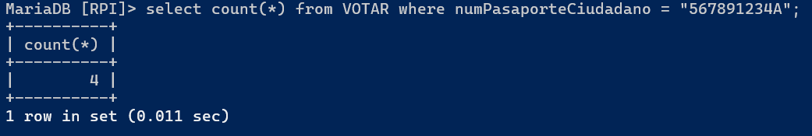
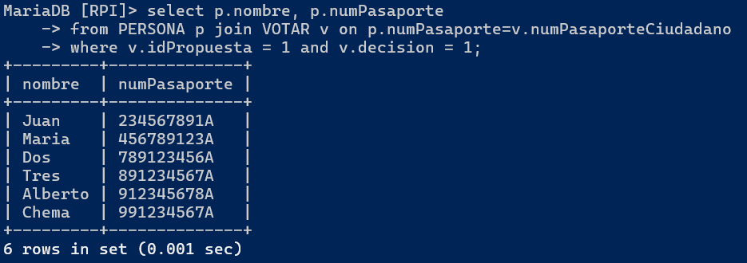
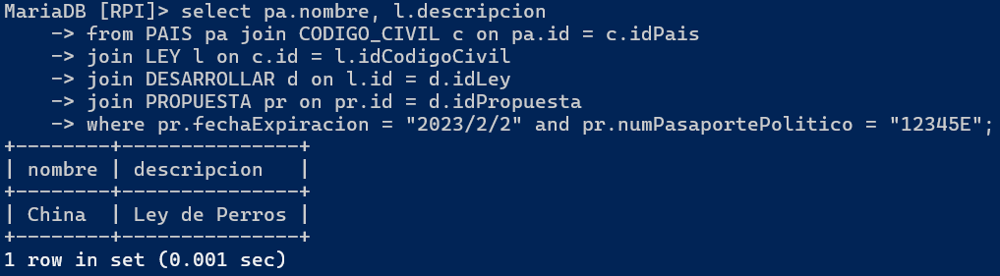
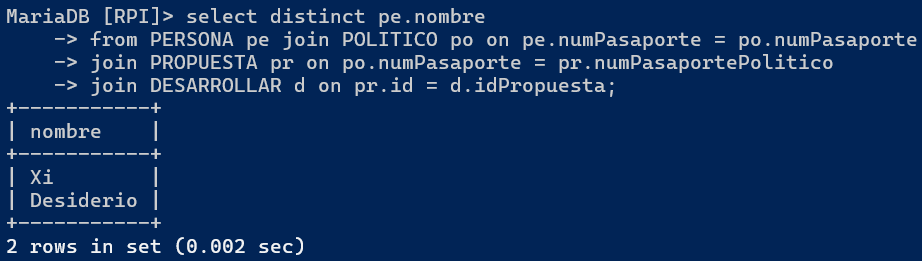
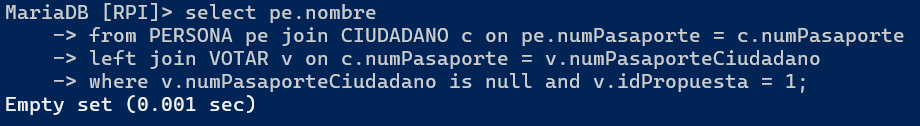
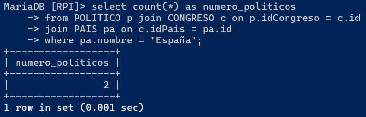
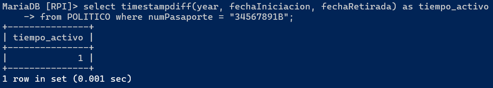
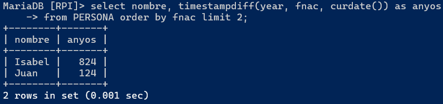
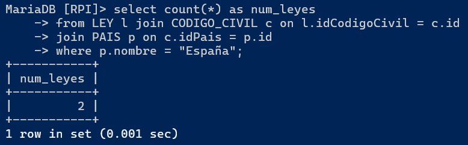
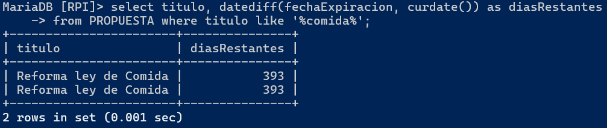

# Consultas Sencillas

### Participantes:
- Diego Fernando Valencia Correa
- Jonathan Villalba Moran

<br>

**1.Cuantas veces ha votado el ciudadano con pasaporte 567891234A**

``` sql
select count(*) from VOTAR where numPasaporteCiudadano = "567891234A";
```



**2.Nombre y numero de pasaporte de todas las personas que han votado a favor la propuesta con idPropuesta 1**

``` sql
select p.nombre, p.numPasaporte 
from PERSONA p join VOTAR v on p.numPasaporte=v.numPasaporteCiudadano
where v.idPropuesta = 1 and v.decision = 1;
```



**3.Mostrar el nombre del pais y la descripcion de la ley que desarrolló la propuesta que expiró el 2023/2/2 y la propuso el político con numero de pasaporte 12345E**

``` sql
select pa.nombre, l.descripcion
from PAIS pa join CODIGO_CIVIL c on pa.id = c.idPais
join LEY l on c.id = l.idCodigoCivil
join DESARROLLAR d on l.id = d.idLey
join PROPUESTA pr on pr.id = d.idPropuesta
where pr.fechaExpiracion = "2023/2/2" and pr.numPasaportePolitico = "12345E";
```



**4.Mostrar nombre de politicos que han propuesta al menos una propuesta la cual ha sido aceptada.**

``` sql
select distinct pe.nombre
from PERSONA pe join POLITICO po on pe.numPasaporte = po.numPasaporte
join PROPUESTA pr on po.numPasaporte = pr.numPasaportePolitico
join DESARROLLAR d on pr.id = d.idPropuesta;
```



**5.Mostrar el nombre de los ciudadanos que no han votado la propuesta con id 1.**

``` sql
select pe.nombre
from PERSONA pe join CIUDADANO c on pe.numPasaporte = c.numPasaporte
left join VOTAR v on c.numPasaporte = v.numPasaporteCiudadano
where v.numPasaporteCiudadano is null and v.idPropuesta = 1;
```



**6.Cuantos politicos hay en el congreso de España**

``` sql
select count(*) as numero_politicos
from POLITICO p join CONGRESO c on p.idCongreso = c.id
join PAIS pa on c.idPais = pa.id
where pa.nombre = "España";
```



**7.Cuanto tiempo en años estuvo activo el politico con numero de pasaporte 34567891B**

``` sql
select timestampdiff(year, fechaIniciacion, fechaRetirada) as tiempo_activo
from POLITICO where numPasaporte = "34567891B";
```



**8. Dime el nombre y la edad en años de las 2 personas con más edad**

``` sql
select nombre, timestampdiff(year, fnac, curdate()) as anyos
from PERSONA order by fnac limit 2;
```



**9. Queremos saber cuantas leyes hay en el codigo civil de españa**

``` sql
select count(*) as num_leyes
from LEY l join CODIGO_CIVIL c on l.idCodigoCivil = c.id
join PAIS p on c.idPais = p.id
where p.nombre = "España";
```



**10. Dime el nombre cuanto tiempo falta en días para que expiren las propuestas relacionadas con la comida**

``` sql
select titulo, datediff(fechaExpiracion, curdate()) as diasRestantes
from PROPUESTA where titulo like '%comida%';
```

