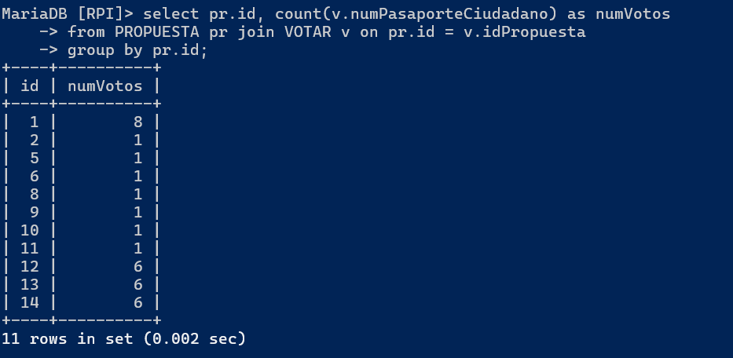
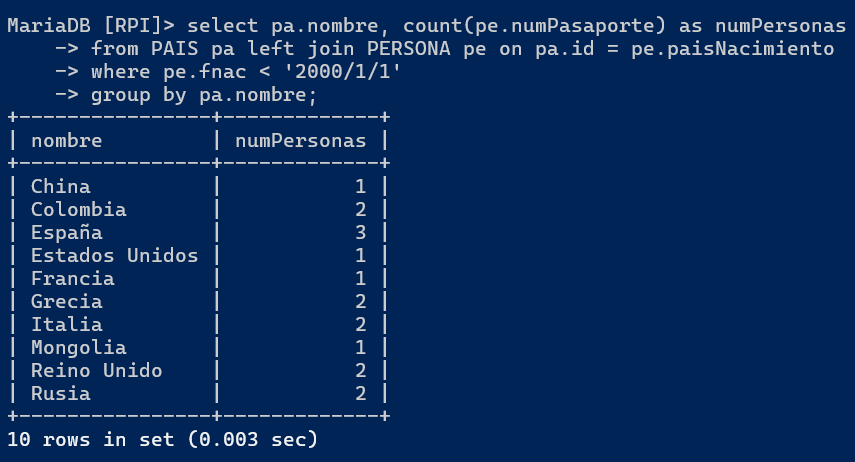
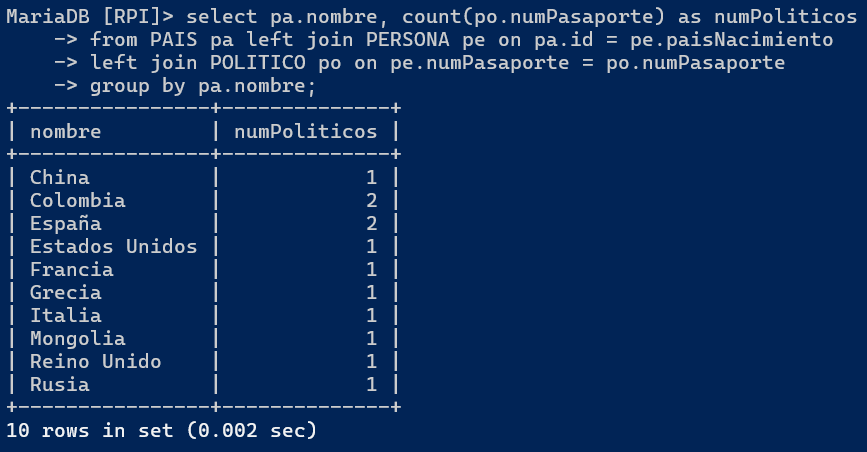
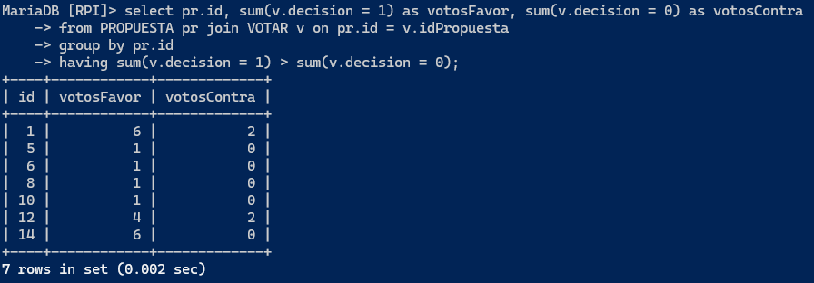
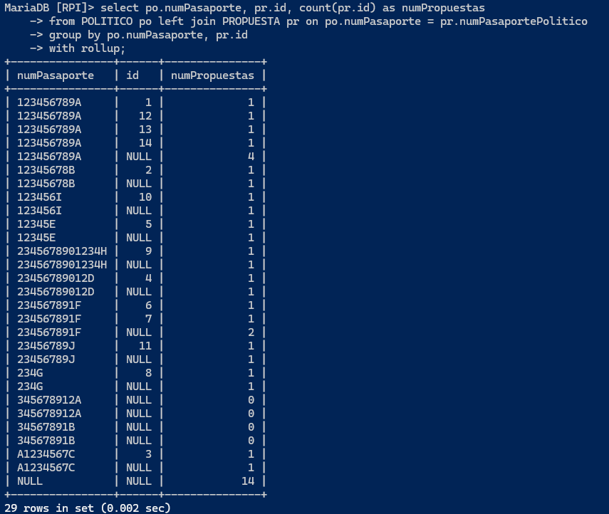
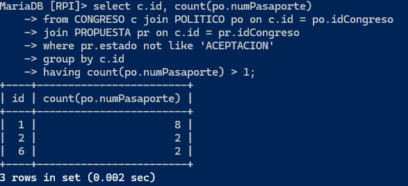
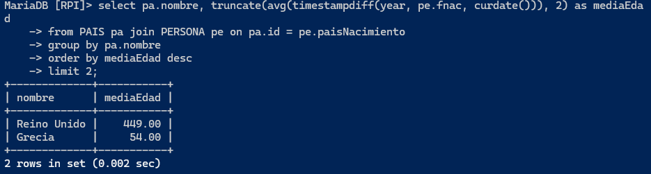
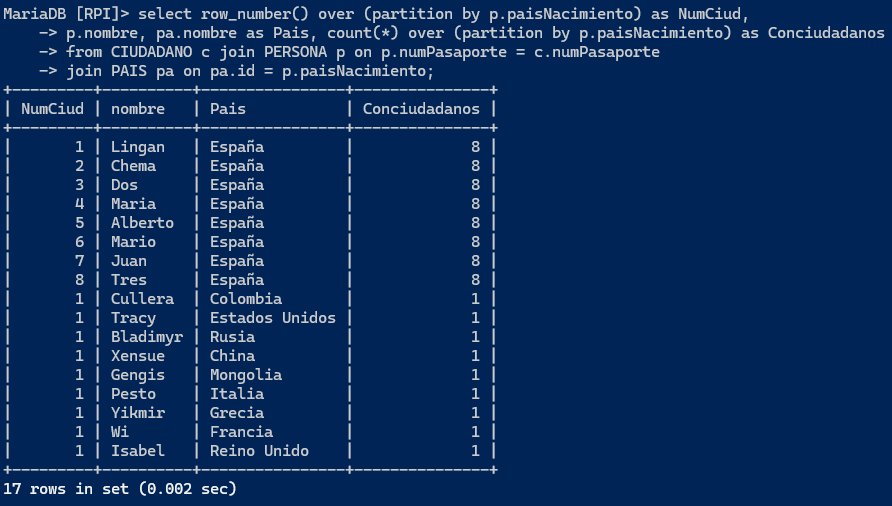
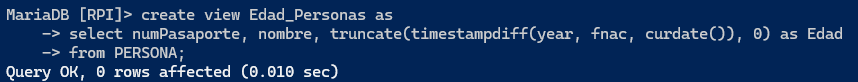
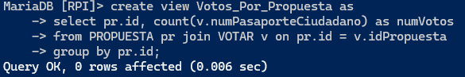

# Consultas

### Participantes:
- Diego Fernando Valencia Correa
- Jonathan Villalba Moran

### Consultas agregadas

**1. Obten el número de personas que han votado cada propuesta**

```
select pr.id, count(v.numPasaporteCiudadano) as numVotos
from PROPUESTA pr join VOTAR v on pr.id = v.idPropuesta
group by pr.id;
```



**2. Cuantas personas hay en cada país que han nacido antes del 2000**

```
select pa.nombre, count(pe.numPasaporte) as numPersonas
from PAIS pa left join PERSONA pe on pa.id = pe.paisNacimiento
where pe.fnac < '2000/1/1'
group by pa.nombre;
```



**3. Obten el número de políticos que hay en cada país**

```
select pa.nombre, count(po.numPasaporte) as numPoliticos
from PAIS pa left join PERSONA pe on pa.id = pe.paisNacimiento
left join POLITICO po on pe.numPasaporte = po.numPasaporte
group by pa.nombre;
```



**4. Obten las propuestas que hayan sido aceptadas (las que tienen más votos a favor que en contra)**

```
select pr.id, sum(v.decision = 1) as votosFavor, sum(v.decision = 0) as votosContra
from PROPUESTA pr join VOTAR v on pr.id = v.idPropuesta
group by pr.id
having sum(v.decision = 1) > sum(v.decision = 0);
```



**5. Obten el pasaporte de los politicos, el id de sus propuestas y la suma del número de propuestas**

```
select po.numPasaporte, pr.id, count(pr.id) as numPropuestas
from POLITICO po left join PROPUESTA pr on po.numPasaporte = pr.numPasaportePolitico
group by po.numPasaporte, pr.id
with rollup;
```



**6. Obten el número de políticos por congreso de los congresos que hayan aceptado más de una propuesta**

```
select c.id, count(po.numPasaporte)
from CONGRESO c join POLITICO po on c.id = po.idCongreso
join PROPUESTA pr on c.id = pr.idCongreso
where pr.estado not like 'ACEPTACION'
group by c.id
having count(po.numPasaporte) > 1;
```



**7. Obten los dos paises con la mayor media de edad en personas**

```
select pa.nombre, truncate(avg(timestampdiff(year, pe.fnac, curdate())), 2) as mediaEdad
from PAIS pa join PERSONA pe on pa.id = pe.paisNacimiento
group by pa.nombre
order by mediaEdad desc
limit 2;
```



### Consulta con función ventana

**1. Obten el orden de los ciudadanos por cada pais y el numero de ciudadanos de su mismo pais**

```
select row_number() over (partition by p.paisNacimiento) as NumCiud, 
p.nombre, pa.nombre as Pais, count(*) over (partition by p.paisNacimiento) as Conciudadanos
from CIUDADANO c join PERSONA p on p.numPasaporte = c.numPasaporte
join PAIS pa on pa.id = p.paisNacimiento;
```



### Consultas con vistas 

**1. Queremos crear una vista para saber la edad las personas**
```
create view Edad_Personas as
select numPasaporte, nombre, truncate(timestampdiff(year, fnac, curdate()), 0) as Edad
from PERSONA;

```



**2. Queremos crear una vista para saber cuantos votos han recibido las propuestas**
```
create view Votos_Por_Propuesta as
select pr.id, count(v.numPasaporteCiudadano) as numVotos
from PROPUESTA pr join VOTAR v on pr.id = v.idPropuesta
group by pr.id;
```




