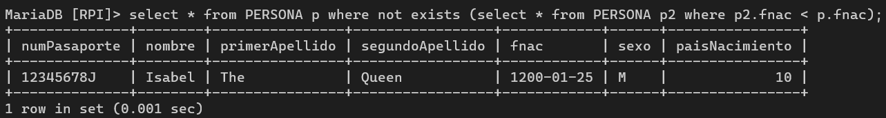
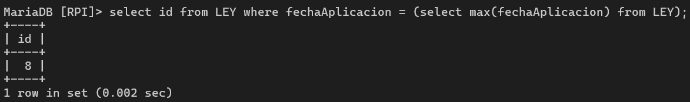

# Consultas 3

**Participantes:** 

Diego Fernando Valencia Correa
Jonathan Villalba Moran

## Definición de 5 consultas que utilicen subconsultas, tanto escalares, como fila y de tabla##

### 1. Obtén la persona mas mayor utilizando not exists

```
select * from PERSONA p where not exists (select * from PERSONA p2 where p2.fnac < p.fnac);
```


### 2. Selecciona el codigo de la ley con la fecha de aplicación más lejana

```
select id from LEY where fechaAplicacion = (select max(fechaAplicacion) from LEY);
```


### 3. Selecciona el numero de pasaporte y nombre de todos los politicos cuya fecha de iniciación no sea la más antigua de su pais

```
select p.numPasaporte, p.nombre from PERSONA p join POLITICO po on p.numPasaporte = po.numPasaporte where po.fechaIniciacion > any (select po2.fechaIniciacion from POLITICO po2 join PERSONA p2 on po2.numPasaporte = p2.numPasaporte where p2.paisNacimiento = p.paisNacimiento);

```

### 4. Selecciona las propuestas que hayan votado mínimo dos ciudadanos y que estos ciudadanos sean mayores de 23

```
select id from propuesta p join votar v on p.id = v.idPropuesta where count(numPasaporteCiudadano) > 1 and 
```

### 5.

```
select
```

## Definición de 2 consultas que utilicen CTE##


## Creación de una tabla a partir del resultado de una consulta compleja##


## Definición de dos índices que mejoren el rendimiento de las consultas ya definida##


## Planes de ejecución, antes y después de la creación de los índices, comprobando su uso##


 