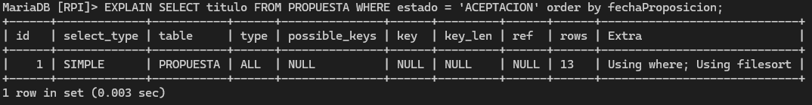

# Consultas 3

**Participantes:** 

- Diego Fernando Valencia Correa
- Jonathan Villalba Moran
- Samini Abdel

<br><br>

## Definición de 5 consultas que utilicen subconsultas, tanto escalares, como fila y de tabla##

### 1. Obtén la persona mas mayor utilizando not exists

``` sql
select * from PERSONA p where not exists (select * from PERSONA p2 where p2.fnac < p.fnac);
```


### 2. Selecciona el codigo de la ley con la fecha de aplicación más lejana

``` sql
select id from LEY where fechaAplicacion = (select max(fechaAplicacion) from LEY);
```


### 3. Selecciona el numero de pasaporte y nombre de todos los politicos cuya fecha de iniciación no sea la más antigua de su pais

``` sql
select p.numPasaporte, p.nombre from PERSONA p join POLITICO po on p.numPasaporte = po.numPasaporte where po.fechaIniciacion > any (select po2.fechaIniciacion from POLITICO po2 join PERSONA p2 on po2.numPasaporte = p2.numPasaporte where p2.paisNacimiento = p.paisNacimiento);

```

### 4. Selecciona las propuestas que hayan votado mínimo dos ciudadanos y que estos ciudadanos sean mayores de 23

``` sql
select id from propuesta p join votar v on p.id = v.idPropuesta where count(numPasaporteCiudadano) > 1 and 
```

### 5.

``` sql

```

<br><br>
<br><br>


## Definición de 2 consultas que utilicen CTE##

<br><br>

### 1. Obten el número de políticos por país
``` sql
WITH PoliticosPorPais AS (
    SELECT c.idPais, COUNT(p.numPasaporte) AS total_politicos
    from POLITICO p
    JOIN CONGRESO c ON p.idCongreso = c.id
    GROUP BY c.idPais
)
SELECT pa.nombre, pp.total_politicos 
from PoliticosPorPais pp
join PAIS pa ON pp.idPais = pa.id;

```

### 2. Obten la propuesta con más votos
``` sql
WITH VotosPorPropuesta AS (
    SELECT idPropuesta, COUNT(*) AS total_votos
    FROM VOTAR
    GROUP BY idPropuesta
)
SELECT P.titulo, vp.total_votos
FROM VotosPorPropuesta vp
join PROPUESTA P ON vp.idPropuesta = P.id
order by  vp.total_votos DESC
LIMIT 1;
```

<br><br>
<br><br>


## Creación de una tabla a partir del resultado de una consulta compleja

create table nombre_tabla as 
select 

<br><br>
<br><br>

## Definición de dos índices que mejoren el rendimiento de las consultas ya definida

<br><br>

### Índice en la tabla PROPUESTA para optimizar búsquedas por estado y fecha

``` sql
CREATE INDEX idx_estado_fecha ON PROPUESTA(estado, fechaProposicion);
```


### Índice en la tabla VOTAR para mejorar la búsqueda por idPropuesta

``` sql
CREATE INDEX idx_votacion_propuesta ON VOTAR(decision);
```


<br><br>
<br><br>

## Planes de ejecución, antes y después de la creación de los índices, comprobando su uso

<br><br>

### Consulta 1 para plan de ejecución
``` sql
EXPLAIN SELECT titulo FROM PROPUESTA WHERE estado = 'ACEPTACION' order by fechaProposicion;
```

### Plan de ejecución antes de la creación del índice:


### Plan de ejecución después de la creación del índice:


### Consulta 2 para plan de ejecución 
``` sql
EXPLAIN SELECT idPropuesta, COUNT(*) as totalVotosFavor FROM VOTAR WHERE decision = 1 GROUP BY idPropuesta;
```

### Plan de ejecución antes de la creación del índice:


### Plan de ejecución después de la creación del índice:

