# Eventos, Triggers, Procedimientos, Funciones y Cursores

**Participantes:**

- Diego Fernando Valencia Correa
- Jonathan Villalba Moran
- Samini Abdel

<br>

## Definición de 2 eventos que automaticen tareas con diferente periodicidad

**1. Actualizar cada día el estado de las propuestas a `TERMINADA` que tengan una fecha de expiración anterior a la actual**

``` sql
delimiter //
create or replace event actualizar_estado_propuestas
on schedule every 1 day starts timestamp(current_date, '00:00:00')
do
begin
     update PROPUESTA
     set estado = 'TERMINADA'
     where fechaExpiracion < now();
end;
//
delimiter ;
```
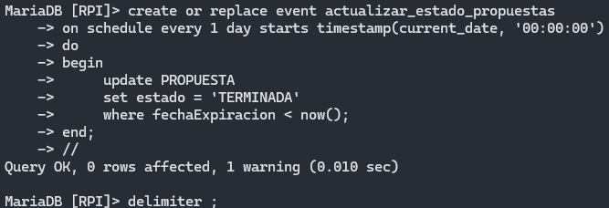

**2. Evento que se ejectua a final de cada mes que crea una tabla en la que guardamos los votos de las propuestas**

```` sql
delimiter //
create or replace event crearPropuestaConVotos
on schedule every 1 month starts timestamp(last_day(current_date), '23:59:59')
do
begin
    drop table PROPUESTA_VOTAR;

    create table PROPUESTA_VOTAR(
    id int unsigned auto_increment,
    titulo varchar(100) not null,
    descripcion varchar(2000) not null,
    fechaExpiracion date,
    estado enum('ACEPTACION', 'PUBLICACION', 'VOTACION', 'TERMINADA') not null,
    idCongreso int unsigned not null,
    numPasaportePolitico varchar(16) not null,
    fechaProposicion date not null,
    fechaAceptacion date,
    fechaPublicacion date,
    votosAFavor int unsigned,
    votosEnContra int unsigned,
    totalVotos int unsigned,
    constraint PK_PROPUESTA_VOTAR primary key (id)
    );

    call desnormalizarPropuestaVotar();
end;
//
delimiter ;
````
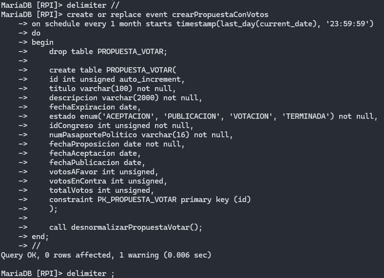

<br>

**Comprobación de que ambos eventos están activos**
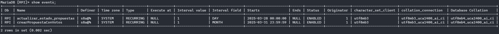

<br>

## Definición de 2 disparadores sobre operaciones asociadas al modelo de datos.

**1. Cada vez que se inserte un nuevo país se creará automaticamente un congreso para este**

 ``` sql
delimiter //
create or replace trigger crearCongreso
after insert on PAIS
for each row
begin
   
    insert into CONGRESO values(new.id, new.id);

end;
//
delimiter ;
```
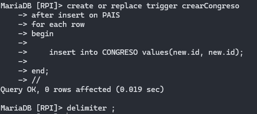

 **2. Cada vez que se inserte un nuevo país se creará automaticamente un código civil para este**

 ``` sql
delimiter //
create or replace trigger crearCodigoCivil
after insert on PAIS
for each row 
    follows crearCongreso
begin

    insert into CODIGO_CIVIL values(new.id, new.id);

end;
//
delimiter ;
```
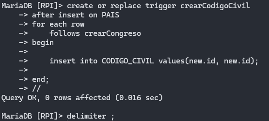


<br>

**Funcionamiento de los trigger**

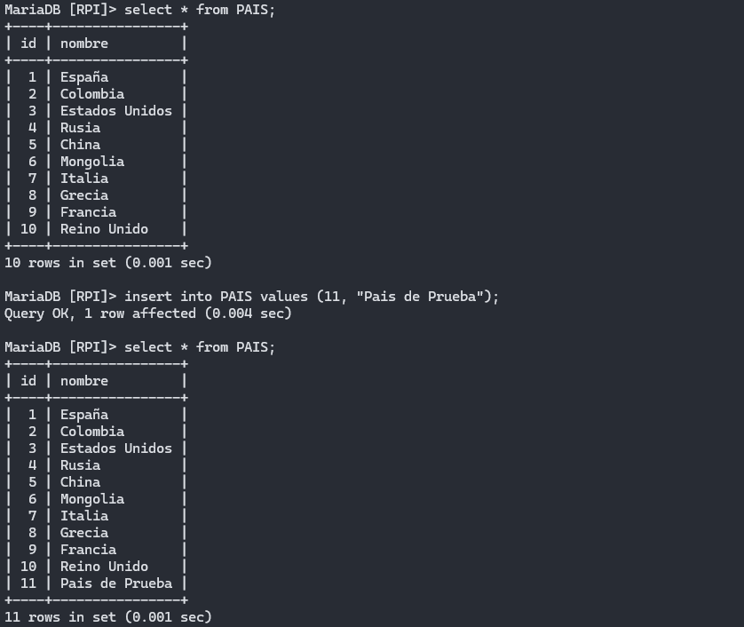
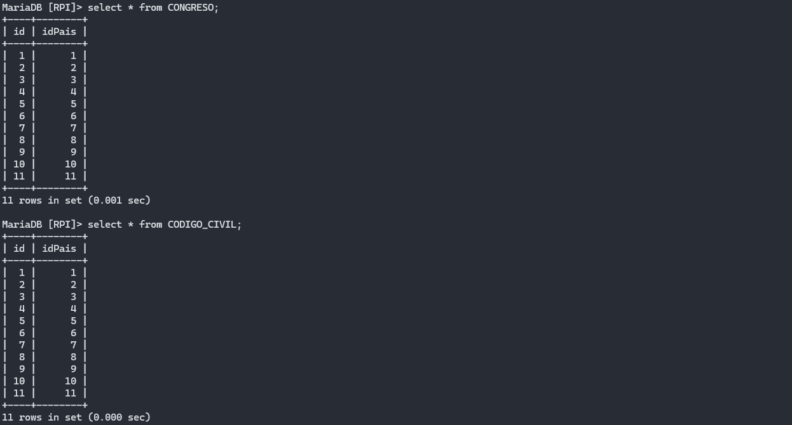


<br>

## Definición de 2 procedimientos almacenados que realicen más de una operación dentro de una transacción, haciendo una gestión adecuada de los errores, ya sea mediante señales o excepciones, y sus consiguientes manejadores.

**1. Procedimiento que inserta una persona y un político al mismo tiempo**
``` sql
delimiter //
create or replace procedure insertPersonaPolitico(in _numPasaporte varchar(16), in _nombre varchar(32), 
    in _primerApellido varchar(32), in _segundoApellido varchar(32), in _fnac date, in _sexo char(1), 
        in _paisNacimiento int unsigned, in _fechaIniciacion date, in _idCongreso int unsigned)
begin
    declare exit handler for sqlexception
    begin
        get diagnostics condition 1
            @mensaje = message_text;
        select @mensaje;
        rollback;
    end;

    start transaction;
    
        insert into PERSONA values (_numPasaporte, _nombre, _primerApellido, _segundoApellido, _fnac, _sexo, _paisNacimiento);

        insert into POLITICO(numPasaporte, fechaIniciacion, idCongreso) values (_numPasaporte, _fechaIniciacion, _idCongreso);

    commit;

end;
//
delimiter ;
```
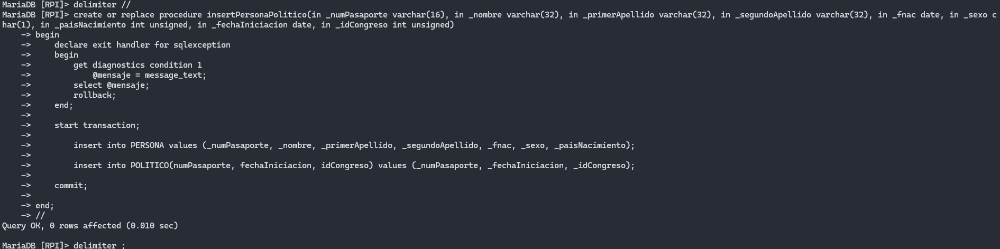
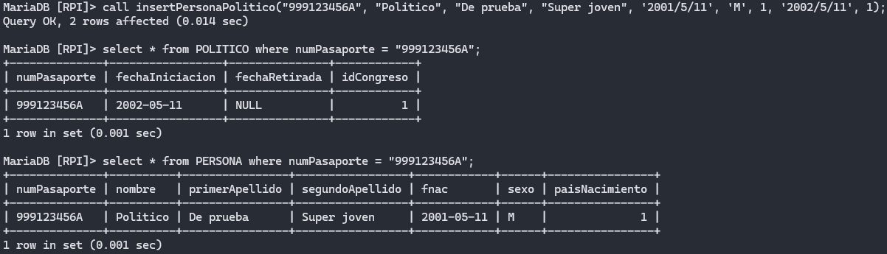


**2. Procedimiento que inserta una persona y un ciudadano al mismo tiempo**
``` sql
delimiter //
create or replace procedure insertPersonaCiudadano(in _numPasaporte varchar(16), 
    in _nombre varchar(32), in _primerApellido varchar(32), in _segundoApellido varchar(32), 
        in _fnac date, in _sexo char(1), in _paisNacimiento int unsigned)
begin

    declare exit handler for sqlexception
    begin
        get diagnostics condition 1
            @mensaje = message_text;
        select @mensaje;
        rollback;
    end;

    start transaction;
    
        insert into PERSONA values (_numPasaporte, _nombre, _primerApellido, _segundoApellido, _fnac, _sexo, _paisNacimiento);

        insert into CIUDADANO(numPasaporte) values (_numPasaporte);
    
    commit;

end;
//
delimiter ;
```

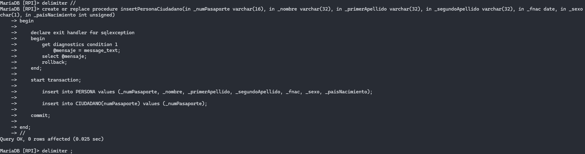
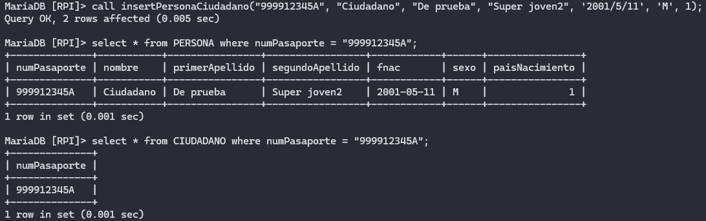


<br>

## Definición de 2 procedimientos almacenados que utilicen cursores que recorran cierta cantidad de datos, realizando operaciones sobre una o más tablas, haciendo una gestión adecuada de los errores, ya sea mediante señales o excepciones, y sus consiguientes manejadores.


**1. Procedimiento utilizado por el evento crearPropuestaConVotos que inserta los datos de `PROPUESTA` en la tabla `PROPUESTA_VOTAR` añadiendo campos para contabilizar los votos a favor, en contra y el total.** 
``` sql
delimiter //
create or replace procedure desnormalizarPropuestaVotar()
begin
    declare fin int default 1;
    declare votosAFavor int unsigned;
    declare votosEnContra int unsigned;
    declare totalVotos int unsigned;
    declare rowPropuesta row type of PROPUESTA;
    declare curPropuesta cursor for select * from PROPUESTA;
    declare continue handler for not found set fin = 0;

    declare exit handler for sqlexception
    begin
        get diagnostics condition 1
            @mensaje = message_text;
        select @mensaje;
        rollback;
    end;


    start transaction;

    open curPropuesta;

    while fin = 1 do
        fetch curPropuesta into rowPropuesta;

        if fin = 1 then

            set votosAFavor = (select count(*) from VOTAR where decision = 1 and idPropuesta = rowPropuesta.id);
            set votosEnContra = (select count(*) from VOTAR where decision = 0 and idPropuesta = rowPropuesta.id);
            set totalVotos = (select count(*) from VOTAR where idPropuesta = rowPropuesta.id);

            insert into PROPUESTA_VOTAR(id, titulo, descripcion, fechaExpiracion, 
                estado, idCongreso, numPasaportePolitico, fechaProposicion, 
                    fechaAceptacion, fechaPublicacion, votosAFavor, votosEnContra, totalVotos)
                values 
                    (rowPropuesta.id, rowPropuesta.titulo, rowPropuesta.descripcion, rowPropuesta.fechaExpiracion, rowPropuesta.estado, 
                        rowPropuesta.idCongreso, rowPropuesta.numPasaportePolitico, rowPropuesta.fechaProposicion, rowPropuesta.fechaAceptacion, 
                            rowPropuesta.fechaPublicacion, votosAFavor, votosEnContra, totalVotos);
            
        end if;

    end while;

    commit;

end;
//
delimiter ;

```

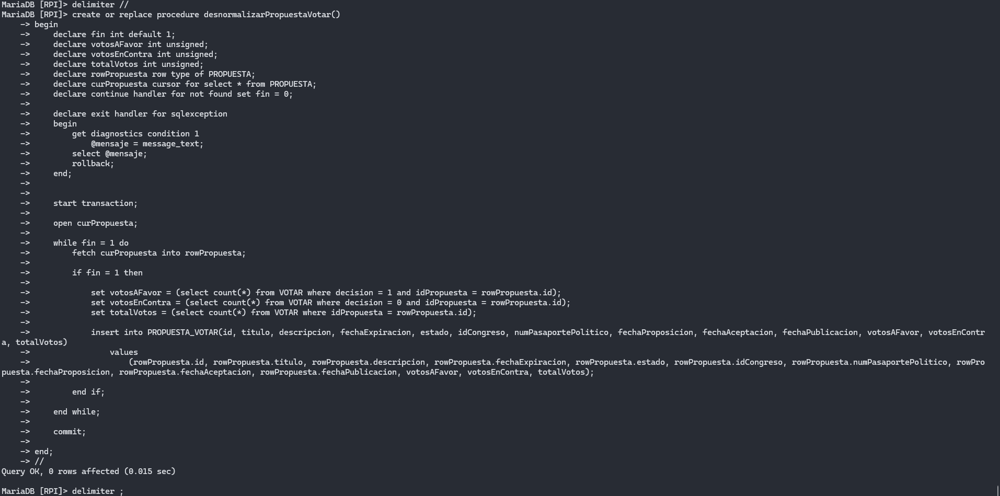
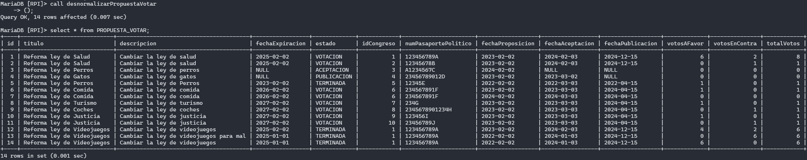


**2. Procedimiento en el que se introduce datos sobre una ley, en caso de que la ley exista se hace un update de los campos que pueden ser alterados, si no existe, se crea.**
``` sql
delimiter //
create or replace procedure upsertLey(in _id int unsigned, in _descripcion varchar(2000), in _fechaAplicacion date, 
    in _fechaModificacion date, in _fechaImplementacion date, in _idCodigoCivil int unsigned)
begin

    declare fin int default 1;
    declare updateHecho int default 0;
    declare rowLey row type of LEY;
    declare curLey cursor for select * from LEY;
    declare continue handler for not found set fin = 0;

    declare exit handler for sqlexception
    begin
        get diagnostics condition 1
            @mensaje = message_text;
        select @mensaje;
        rollback;
    end;

    start transaction;
    
    open curLey;
    
    while fin = 1 do
        fetch curLey into rowLey;

        if fin = 1 then

            if _id = rowLey.id then
                update LEY
                    set descripcion = _descripcion, fechaAplicacion = _fechaAplicacion, fechaModificacion = _fechaModificacion 
                        where id = _id;
                    set updateHecho = 1;
            end if;

        end if;

    end while;

    if updateHecho = 0 then
        insert into LEY(descripcion, fechaAplicacion, fechaModificacion, fechaImplementacion, idCodigoCivil)
            values
                (_descripcion, _fechaAplicacion, _fechaModificacion, _fechaImplementacion, _idCodigoCivil);
    end if;

    commit;

end;
//
delimiter ;
```

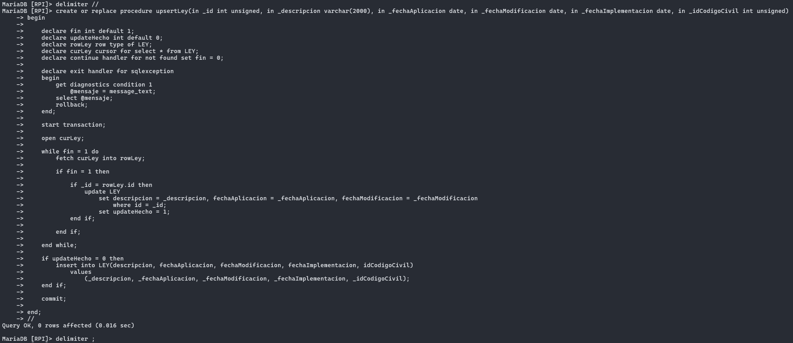
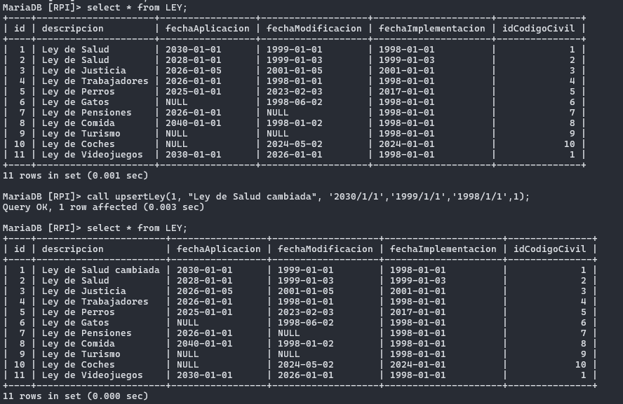
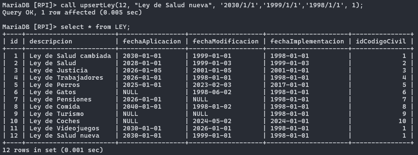

