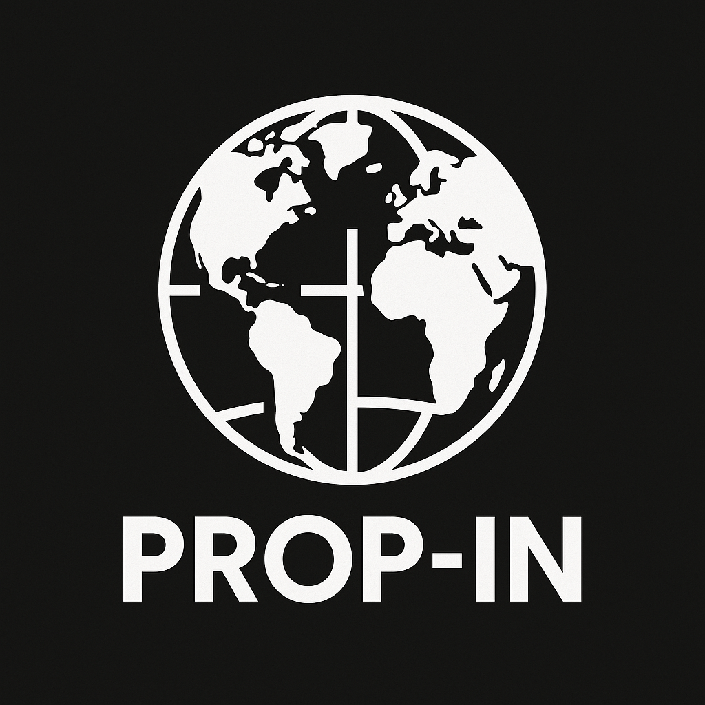

# Proyecto: PROP-IN

### 

Sistema de Gestión de Votaciones y Propuestas de Reforma Legal a Nivel Internacional.

PROP-IN (Propuestas Internacionales) es un proyecto en el que se recogen las propuestas de reforma de ley de los distintos países con los que trabajamos. 
Además se guardan las leyes y votaciones, que agilizamos mediante nuestra aplicación en la que se puede votar.

### Participantes:
- [Diego Fernando Valencia Correa](https://github.com/DocD1306)
- [Pablo Bernabeu Robles](https://github.com/bernabeu17)
- [Jonathan Villalba Moran](https://github.com/JonathanWick21)
- [Abdel Moghit Samini](https://github.com/Samini04)

 

### Tabla de contenidos

#### Diseño de la base de datos

- [Modelo Entidad-Relacion](MDs/Modelo_Entidad-Relacion.md)
- [Modelo Relacional](MDs/Modelo-Relacional.md)
- [Diccionario de Datos](MDs/Diccionario_De_Datos.md)
- [Restricciones de Borrado/Modificación de tablas](MDs/Restricciones_Borrado_Tablas.md)

#### Desarrollo de la base de datos en SQL

- [Instrucciones DDL](MDs/Instrucciones_DDL.md)
- [Script para vaciar las tablas](MDs/Script_Vaciar_Tablas.md)
- [Instrucciones DML](MDs/Instrucciones_DML.md)

#### Consultas sobre la base de datos
- [Consultas Sencillas](MDs/Consultas.md)
- [Consultas Agregadas](MDs/Consultas2.md)
- [Subconsultas](MDs/Consultas3.md)
- [Eventos, Triggers, Procedimientos, Funciones y Cursores](MDs/Consultas4.md)

#### Implementación en Java

- [UML](MDs/UML.md)
- [Codigo Java](/Java/)
- [Repartición de tareas MVC / DAO](MDs/reparticionDAO.md)

#### Modelos para la transmisión de datos

- [XML & JSON](MDs/XML_JSON.md)

#### Diseño de la interfaz de la aplicación

- [Diseño de la interfaz](MDs/Interfaz.md)

 

### Descripción del proyecto:
Somos una **organización mundial** conformada por varios países y queremos almacenar las votaciones de propuestas de reforma de ley de cada país.

De cada **ciudadano** que esté capacitado (ha pasado por una prueba de conocimentos mínimos) para votar se desea conocer su nombre, apellidos, sexo, fecha de nacimiento, pasaporte y país de nacimiento.

De los **políticos** también queremos saber su nombre, apellidos, sexo, fecha de nacimiento, pasaporte, fecha en la que tomaron el cargo y fecha en la que se retiraron (en caso de que lo hayan hecho). Estos proponen propuestas y queremos almacenar el número de propuestas que han iniciado.

Un ciudadano capacitado puede opositar para convertirse en político, aunque también pueden haber ciudadanos no capacitados (de los cuales no guardamos información) que opositen y se conviertan en políticos directamente.

Los políticos forman un **congreso**, el cual hace una votación para decidir si hacer públicas las propuestas y del cual queremos saber el número de propuestas que han aceptado para ser públicas, además queremos saber el número de políticos que lo conforma.

De las **propuestas** necesitamos saber su código, su título, su descripción, la fecha de presentación al congreso, la fecha de publicación, la fecha en la que acaba el plazo de su votación, el número total de votos, los votos a favor y los votos en contra.

Las propuestas pueden ser votadas por los ciudadanos capacitados pero no por los políticos. Las propuestas pueden ser votadas únicamente por ciudadanos que hayan nacido en el país en el que se publica la propuesta. Para que la votación sea valida tienen que votar como mínimo el 51% de los ciudadanos. Para que la propuesta sea aceptada ha de tener mínimo un 51% de votos a favor.

Las propuestas desarrollan **leyes**, de las que deseamos conocer su código identificativo, su descripción, fecha de última modificación, fecha de primera implementación y la fecha en la que se aplican sus efectos.

Las leyes forman un **código civil**, del que necesitamos conocer, su código identificadivo, la cantidad de leyes que lo conforman y fecha de última modificación.

El código civil rige a un **país** (del que se quiere conocer su nombre, cantidad de políticos y ciudadanos capacitados que tiene) y un país solo puede ser regido por un único código civil. 
